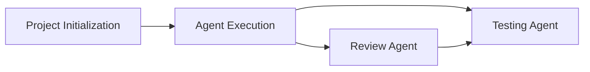

---
tags:
  - MOC
  - agent
  - prompt
  - ai
---

# AI Agents — Prompt Library

Kumpulan prompt untuk berbagai AI coding agent (OpenCode, Claude Code, Codex, dll).

---

## Workflow Pipeline



Pipeline ideal: **Ideate → Build → Review → Test**

1. [[Project Initialization]] — wawancara founder, hasilkan PRD
2. [[Agent Execution]] — eksekusi PRD jadi kode module Omniflow
3. [[Review Agent]] — review kualitas kode
4. [[Testing Agent]] — validasi fungsionalitas kritis

---

## General Agents

| Prompt | Role | Input → Output |
|--------|------|---------------|
| [[Project Initialization]] | Product Strategist | Raw idea → PRD.md |
| [[Testing Agent]] | Test Engineer | Code → Test cases |
| [[Review Agent]] | Code Reviewer | Code → Improvement suggestions |

---

## Omniflow Agents

| Prompt | Role | Input → Output |
|--------|------|---------------|
| [[Agent Execution]] | AI Builder | PRD → Working module |
| [[Starter Template Rebranding]] | DevOps | Template → New module boilerplate |
| [[Port Management]] | DevOps | Repo → Standardized ports |

---

## Usage Guide

### For New Project

1. Copy-paste [[Project Initialization]] prompt → wawancara interaktif → dapatkan PRD
2. Kalau butuh module Omniflow Express:
   - Jalankan [[Starter Template Rebranding]] untuk bikin boilerplate
   - Jalankan [[Port Management]] untuk standarisasi port
3. Feed PRD ke [[Agent Execution]] → generate kode
4. Review dengan [[Review Agent]]
5. Test dengan [[Testing Agent]]

### For Existing Code

1. [[Review Agent]] → dapatkan improvement suggestions
2. [[Testing Agent]] → validasi critical paths

---

## Agent Compatibility

Semua prompt kompatibel dengan:
- **OpenCode** (CLI AI coding)
- **Claude Code** (Anthropic)
- **Codex CLI** (OpenAI)
- Cursor / Windsurf (via chat/rules)

Cara pakai: copy seluruh isi file prompt ke chat agent.

---

## Directory

```
AI Agents/
├── README.md              ← this file
├── General/
│   ├── Project Initialization.md
│   ├── Testing Agent.md
│   └── Review Agent.md
└── Omniflow/
    ├── Agent Execution.md
    ├── Starter Template Rebranding.md
    └── Port Management.md
```

---

## Omniflow Knowledge

Lihat [[Omniflow/README|Omniflow Hub]] untuk referensi arsitektur lengkap:
- [[Omniflow/Architecture Reference]] — konvensi arsitektur Omniflow-Starter
- [[Omniflow/Context Extraction (Audit)]] — full audit semua komponen
- [[Omniflow/AI Context (CLAUDE)]] — comprehensive AI agent context
