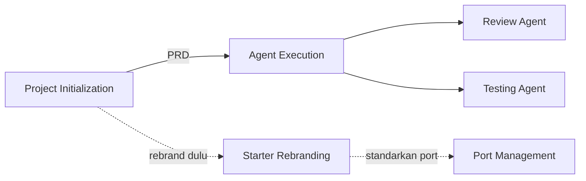

---
tags:
  - omniflow
  - hermes
  - ai-context
  - summary
source: "[[Omniflow-Starter]]"
generated_by: Hermes (Nous Research)
generated_at: 2026-07-20
---

# Hermes Context — Omniflow Distilled

> Ringkasan dari `AI Context (CLAUDE).md` (83KB), `Architecture Reference.md` (11KB), `Context Extraction (Audit).md` (34KB), dan `AI Agents/*.md` agar konteks cepat di-inherit.

## 1. Big Picture

**Omniflow** = suite ERP SaaS monorepo. Backend inti = **monolith** dari `Omniflow-Starter` (Express+MySQL+Nunjucks). 50+ modul turunan (HRIS, Accounting, Asset, DMS, DealDesk, Helpdesk, KMS, dll) di-bootstrap dengan copy+rebrand+reskin.

Bahasa/framework lain (Rust/Go/Laravel/Phoenix/Actix/Elysia/FastAPI/Flutter) dipakai **selektif** — hanya untuk service yang butuh performance (e.g. Omniflow-AI-Backend, Omniflow-ClickHouse ingestion, Omniflow-Excel-Microservice).

## 2. Tech Stack Omniflow-Starter

| Layer | Tech |
|---|---|
| Runtime | Node.js + Express 4 (CommonJS) |
| DB | MySQL via `mysql2` pool — **raw SQL only, no ORM** |
| Migrations | Knex.js (`db/migrations/`) |
| Templating | Nunjucks SSR |
| Auth (web) | express-session |
| Auth (API) | JWT |
| Cache | Redis (with DB fallback) |
| Queue | RabbitMQ (with circuit breaker) |
| Security | helmet, csrf-csrf, express-rate-limit, botProtection, cspNonce, cors |
| Logging | `helpers/log.js` (activity_logs table) + emoji console logs |
| Files | Multer, ExcelJS, S3-compatible |
| i18n | EN / ID / ZH (locales/) |
| Telemetry | OpenTelemetry + Langfuse (LLM tracing) |
| Code quality | Biome (format + lint) |
| Notif | BeepBot (external critical alerts) |

**No test framework** di Starter — manual testing via `examples/implement_jwt.html`.

## 3. Module Pattern (paling penting)

```
routes/admin/{feature}/
  {feature}.router.js          # Express router definition
  {feature}.controller.js      # Optional: shared controller
  actions/                     # One file per HTTP action
    getXxxPage.js
    createXxx.js
    updateXxx.js
    deleteXxx.js
routes/api/{feature}/
  {feature}.router.js
views/pages/admin/{feature}/
  index.njk
  form.njk
  detail.njk
db/migrations/YYYYMMDDHHMMSS_create_{table}.js
```

**Konvensi kunci**:
- URLs: `/admin/{feature}`, `/api/{feature}`
- DB: `snake_case`, `id` PK, `created_at`/`updated_at`/`deleted_at`, FK `{table}_id`
- Middleware: `isLoggedInAndActive` → `adminLimiter` → `checkPermission(...)` → `doubleCsrfProtection` (POST)
- Views: extend `masterLayout.njk`, pakai `csrfField() | safe`, `hasPermission(...)` di sidebar
- Errors: `throw new ValidationError("...", "field")`, caught by `centralizedErrorHandler`
- Import alias: `@helpers`, `@db`, `@middlewares`, `@routes`, dll (registered di `package.json` `_moduleAliases`)
- Import order (strict): side-effect → core (node:) → third-party → alias → relative

## 4. AI Agent Workflow (workflow utama Eric)



1. **Project Initialization** — interview interaktif founder → PRD.md
2. **Starter Rebranding** — copy starter, replace `omniflow-starter` → `omniflow-<module>` (~15 file: package.json, .env*, helpers/log.js, helpers/langfuse.js, db migrations, config/index.js, README, CLAUDE.md, DOCKER.md, docs/)
3. **Port Management** — sesuai policy (4xxx/6xxx/9xxx/10xxx/20xxx/40xxx/50xxx)
4. **Agent Execution** — implement PRD jadi module (follow existing patterns, NO new framework, NO ORM, NO TS, NO React)
5. **Review Agent** — pragmatic review (HIGH/MEDIUM/LOW priority)
6. **Testing Agent** — confidence over coverage, no heavy framework

## 5. Port Policy (Omniflow standard)

| Range | Purpose |
|---|---|
| `4xxx` | Production client apps |
| `6xxx` | Trial apps |
| `9xxx` | Demo / staging / fresh product / internal tooling (default Express+Nunjucks) |
| `10xxx` | `*-Frontend` |
| `20xxx` | `*-Backend` |
| `40xxx` | Infra / control plane / internal services |
| `50xxx` | Starter templates |

Env: `.env` = dev, `.env.prod` = prod, `.env.example` = template. MySQL host `33060` (bukan 3306). Postgres host `54320` (bukan 5432).

## 6. Key Gotchas

- ⚠️ **Service layer (`/services`) lightly used** — logika bisnis biasanya di route handler. Konsisten dengan itu.
- ⚠️ **`.env` di-track di git** as template. Audit Mar 2026 nemu credential live (DB host `100.114.179.76`, password `rootpassword123`, Langfuse keys) masih ter-commit — worth verify & rotate.
- ⚠️ **Tidak ada test framework** — agent Testing Agent nggak boleh introduce framework berat.
- ⚠️ **AI features included by default** di bootstrap — remove post-bootstrap kalau module nggak butuh.
- ⚠️ **`.gitignore` line `.env.bakuploads/` malformed** — should be split.

## 7. Cara Baca Cepat Konteks

Untuk onboarding ke module baru:
1. `Architecture Reference.md` (11KB) — pola & konvensi
2. `Context Extraction (Audit).md` (34KB) — apa aja yang di-copy + risks
3. `AI Context (CLAUDE).md` (83KB) — full reference (termasuk env vars lengkap, helpers API, import order)
4. Folder `knowledge/` di repo Starter (85 markdown file) — AI context per fitur

## Related

- [[Architecture Reference]] — definitive architecture conventions
- [[Context Extraction (Audit)]] — full audit & MUST COPY list
- [[AI Context (CLAUDE)]] — comprehensive AI agent context (raw, 2199 lines)
- [[Agent Execution]] — builder prompt
- [[Project Initialization]] — PRD generator
- [[Review Agent]] / [[Testing Agent]] — quality gates
- [[Starter Template Rebranding]] / [[Port Management]] — bootstrap helpers
