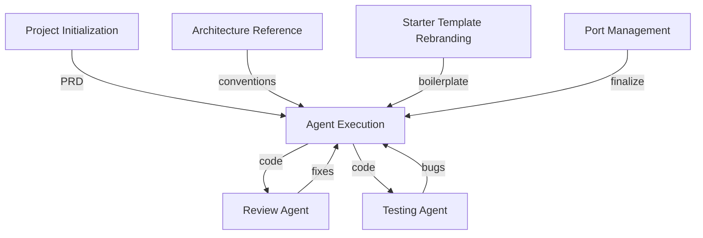

---
tags:
  - MOC
  - omniflow
  - starter
  - architecture
---

# Omniflow — Knowledge Hub

Referensi arsitektur dan dokumentasi untuk ekosistem **Omniflow-Starter** — semua modul Omniflow lahir dari boilerplate ini.

---

## Core Documents

| Document | Type | Content |
|----------|------|---------|
| [[Architecture Reference]] | Arsitektur | Tech stack, folder structure, module patterns, database, routing, views, auth, error handling (420 lines) |
| [[Context Extraction (Audit)]] | Audit Report | Full audit semua layer: config, DB, helpers, middlewares, routes, views, services, workers (941 lines) |
| [[AI Context (CLAUDE)]] | AI Context | Comprehensive AI agent documentation: semua fitur, security, caching, queue, logging (2199 lines) |
| [[Template Changelog]] | Maintenance | Registry fix/improvement template dasar yang wajib di-backport ke semua modul + tabel rollout status per modul |

---

## AI Agent Prompts (Omniflow-Specific)

| Prompt | Purpose |
|--------|---------|
| [[Agent Execution]] | Build new module dari PRD mengikuti pola Omniflow-Starter |
| [[Starter Template Rebranding]] | Rebrand starter template jadi module baru |
| [[Port Management]] | Standarisasi port sesuai policy Omniflow |
| [[Template Backport]] | Terapkan entry [[Template Changelog]] ke modul yang sedang dibuka |

---

## AI Agent Prompts (General)

| Prompt | Purpose |
|--------|---------|
| [[Project Initialization]] | Ideation → PRD (input untuk Agent Execution) |
| [[Review Agent]] | Review kualitas kode |
| [[Testing Agent]] | Validasi critical paths |

---

## Omniflow Ecosystem

Repo Omniflow-Starter terletak di: `C:\Users\Braincore\Documents\GitHub\Omniflow-Starter`

Module-module turunan:
- Omniflow-HRIS, Omniflow-Inventory, Omniflow-Sales, Omniflow-Purchasing
- Omniflow-Asset-Management, Omniflow-Helpdesk, Omniflow-KMS
- Omniflow-Accounting, Omniflow-XRM, Omniflow-PoS
- ...dan 50+ modul lainnya

Semua modul mengikuti [[Architecture Reference]] yang sama.

---

## Workflow Development Baru

1. [[Project Initialization]] — gali ide, hasilkan PRD
2. [[Starter Template Rebranding]] — siapkan boilerplate dari starter
3. [[Port Management]] — pastikan port sesuai policy
4. [[Agent Execution]] — generate kode mengikuti [[Architecture Reference]]
5. [[Review Agent]] — review structure & security
6. [[Testing Agent]] — validasi critical logic
